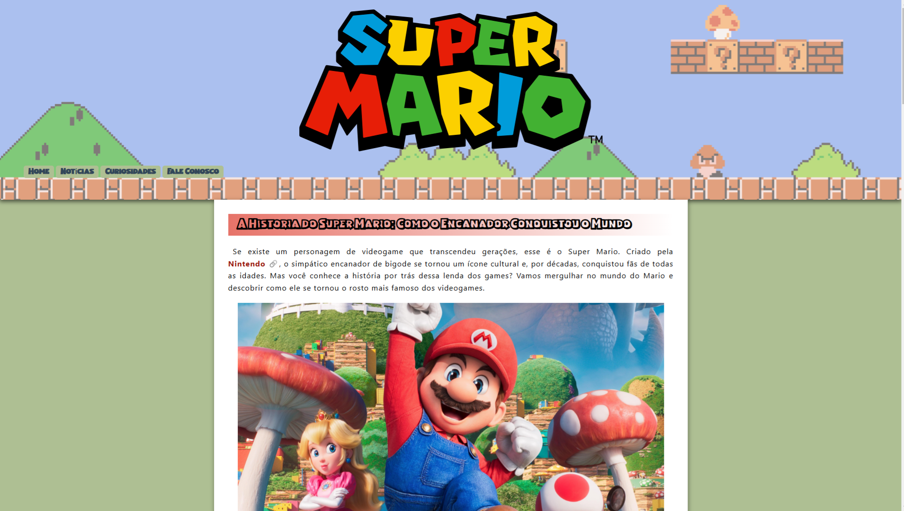
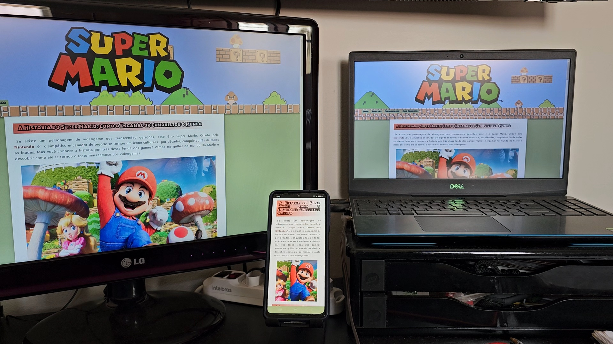
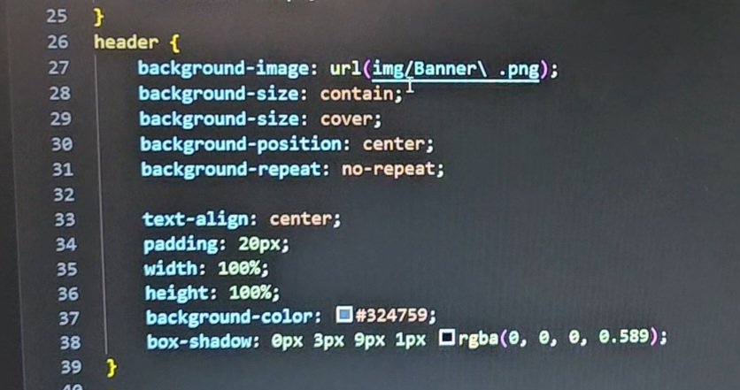

# A História do Super Mario

# Sobre o Projeto
 Este projeto é um site dedicado à história do Super Mario, um dos personagens mais icônicos dos videogames. O objetivo foi criar um site visualmente atrativo, responsivo e interativo, utilizando HTML, CSS e um pouco de JavaScript.
 
 
# Tecnologias Utilizadas
* HTML: Estrutura e conteúdo do site.
* CSS: Estilização e design, garantindo um visual bonito e profissional.
* JavaScript: Adicionando interatividade com um botão funcional.
# Funcionalidades
* Responsividade: O site se adapta a diferentes dispositivos, proporcionando uma boa experiência tanto em desktops quanto em smartphones.
* Estilo Atraente: Um design cuidadosamente trabalhado para capturar a essência do universo do Super Mario.
* Interatividade: Um botão funcional para melhorar a experiência do usuário.

 
# Meu Aprendizado
  * Tenho mais experiência com HTML e CSS, e este projeto reflete meu conhecimento nessas áreas.
  * Com JavaScript, explorei conceitos básicos e estou estudando mais por conta própria para aprimorar minhas habilidades.

  * Queria destacar um aprendizado muito importante que tive criando esse site, o background-image que foi uma funcionalidade incrível que eu aprendi a utilizar no meu cabeçalho. Aprendi essa funcionalidade sozinho, pesquisando e indo atrás de deixar um cabeçalho elegante. Nâo aprendi sobre o background-image no meu curso de html e css, mas eu sou muito curioso e procuro funcionalidades novas que eu ainda não vi para utilizar e aprender.

   
# Como Visualizar o Site
Acesse esse link: https://carlosdanielsv.github.io/Mario/mario.html
# Próximos Passos
* Aprimorar meu conhecimento em JavaScript para implementar novas funcionalidades no site.
* Adicionar mais conteúdo sobre a história do Super Mario.
* Explorar animações e efeitos avançados com CSS e JavaScript.
# Feedback
Se você tiver sugestões, correções ou apenas quiser compartilhar sua opinião sobre o projeto, sinta-se à vontade para abrir uma issue ou me enviar uma mensagem.
#
Espero que você goste do site! 😊

